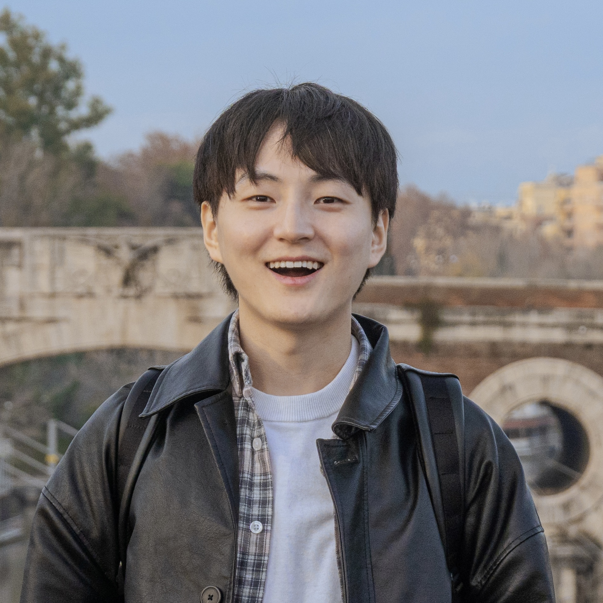

::::::::::::: profile-layout
::::::::::: {.profile-panel aria-label="Profile"}
::: {.profile-avatar}
{.profile-photo}
:::

```{=html}
<!--
To use a real portrait, replace the .profile-avatar block above with:

::: {.profile-photo}
{alt="Portrait of Name Surname"}
:::

A square or 4:5 portrait works best. The CSS crops it responsively.
-->
```

::::::: profile-identity
::: profile-name
Sanghyeon Jeon
:::

::: profile-role
Ph.D. Student in Mass Communication
:::

::: profile-affiliation
University of Georgia
:::

::: profile-location
Athens, GA, United States
:::
:::::::

::: profile-contact
[Email](mailto:sanghyeon.jeon@uga.edu){.profile-contact-item} [Google Scholar](https://scholar.google.com/citations?user=keolv4YAAAAJ){.profile-contact-item} [ORCID](https://orcid.org/0009-0006-3532-5501){.profile-contact-item} [LinkedIn](https://linkedin.com/in/sanghyeon-jeon){.profile-contact-item}
:::

::: profile-note

:::
:::::::::::

::: profile-main
## About

I am broadly interested in how people experience, interpret, and respond to media and information, particularly the cognitive and affective processes that shape these responses. I am also interested in how these processes can be conceptualized and measured across different methodological approaches.

Ultimately, I hope to use this understanding to explore how communication and media environments can be designed and shaped to better support individual well-being and positive social outcomes.

*\* I love capturing beautiful landscapes and everyday moments. If you'd like to see my work, feel free to check out my photos* [here](https://sanghyeon1.myportfolio.com)!\*

:::
:::::::::::::